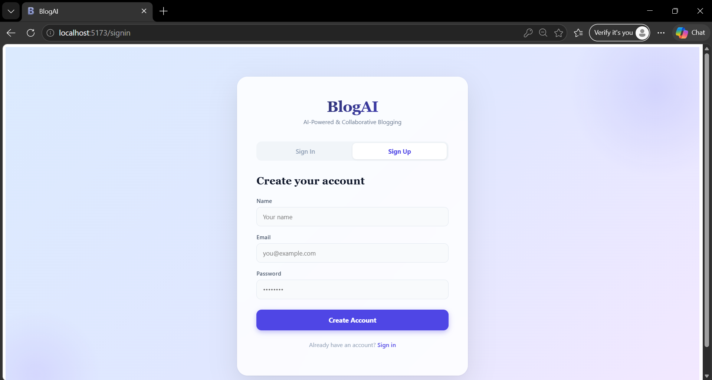
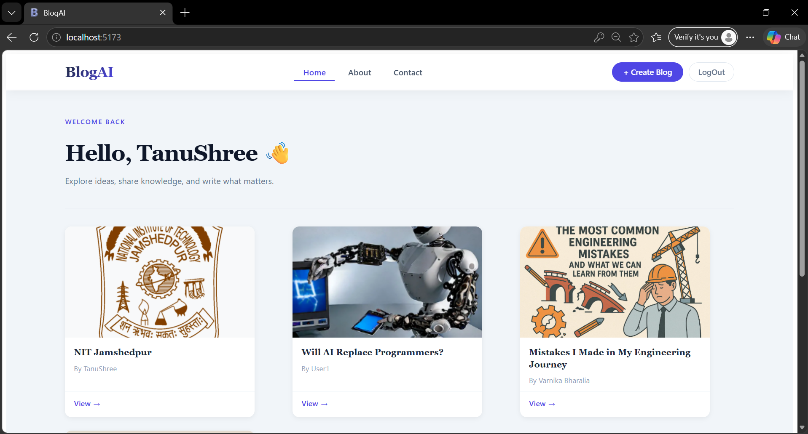
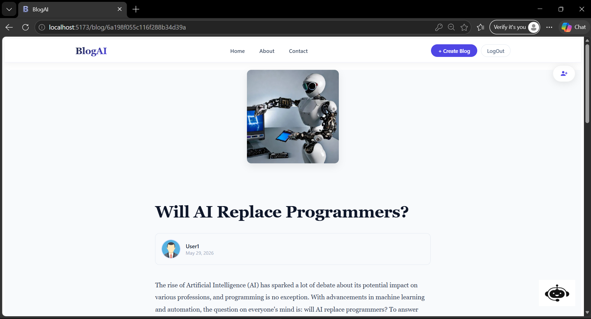
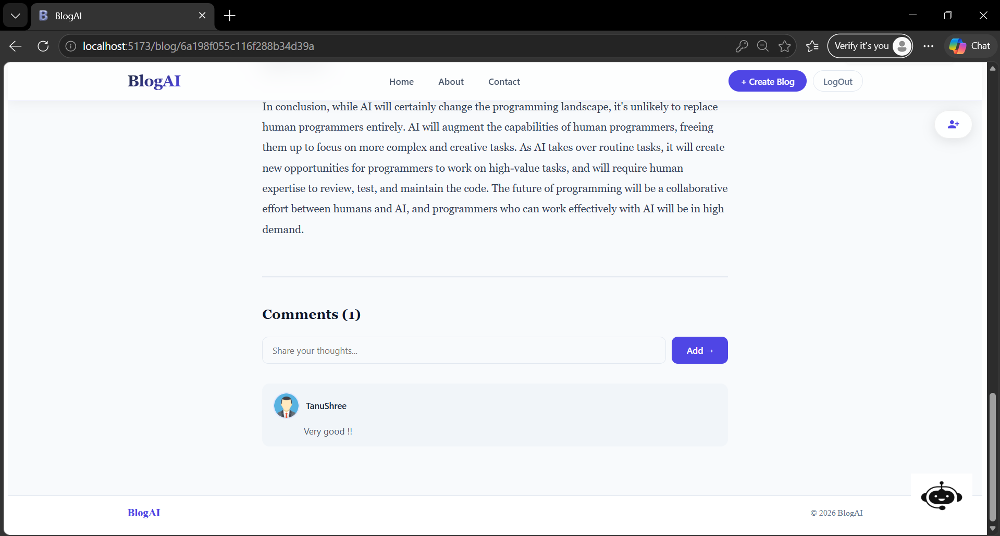
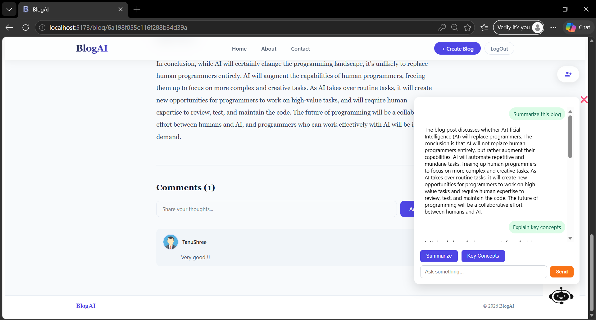
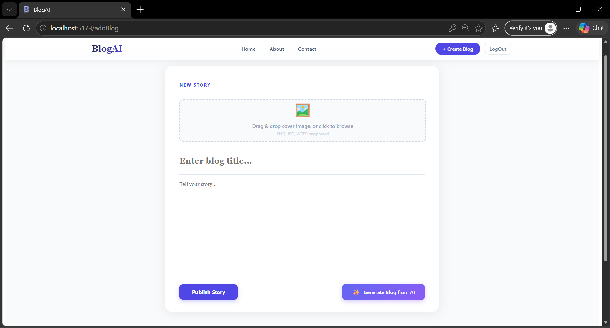
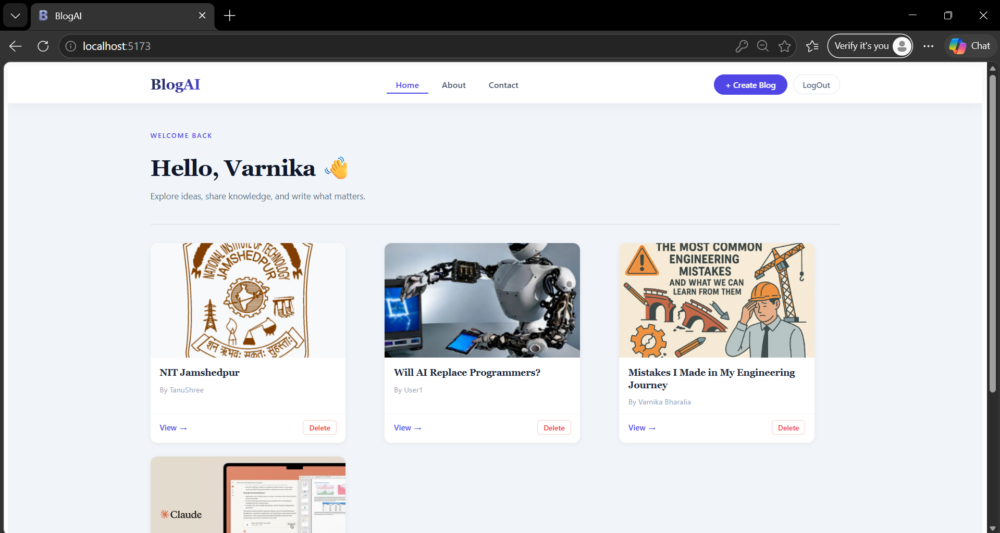
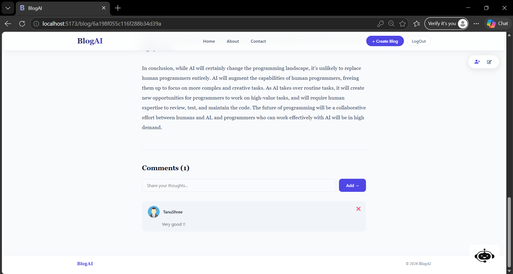
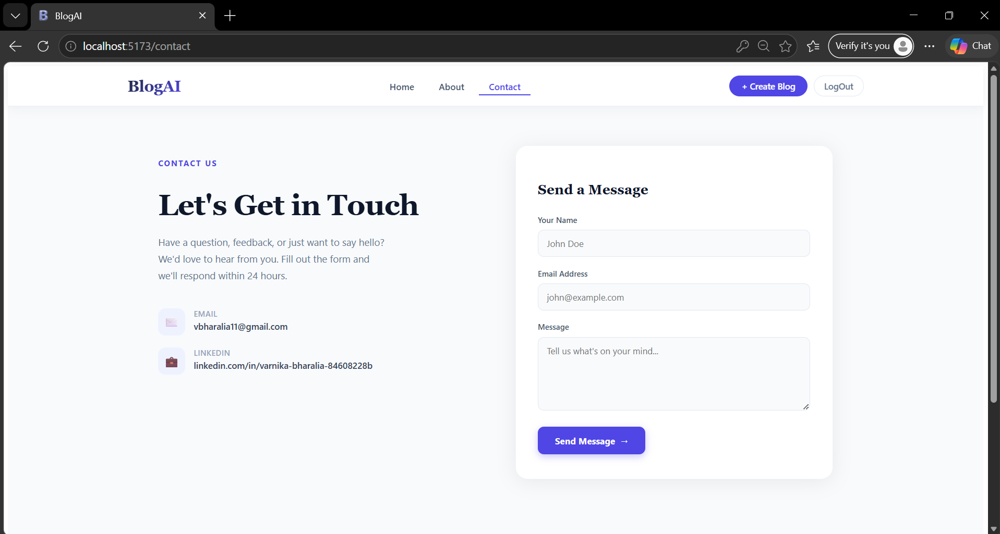
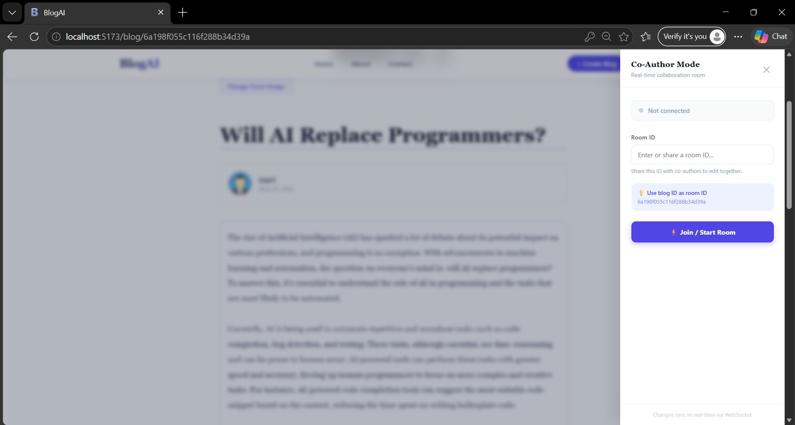

# 🚀 BlogAI

BlogAI is a modern AI-powered blogging platform that enables users to create, publish, edit, and collaborate on blogs seamlessly. The platform combines traditional blogging features with Generative AI capabilities, allowing users to generate blog content, interact with blogs through an AI assistant, and collaborate in real time.

---

## ✨ Features

### 🔐 Authentication & Authorization
- Secure user registration and login
- JWT-based authentication using HTTP-only cookies
- Role-based access control
- Admin and User roles

### 📝 Blog Management
- Create blogs with title, content, and cover image
- Edit existing blogs
- Delete blogs (Admin only)
- Rich blog viewing experience
- Author information display

### 🤖 AI-Powered Blog Generation
- Generate complete blog content using AI
- Powered by Groq LLM
- Helps users quickly create high-quality articles

### 💬 AI Blog Assistant
- Chat with an AI assistant about any blog
- Ask questions related to blog content
- Summarize blogs
- Explain key concepts
- Persistent chat history

### 👥 Real-Time Collaboration
- Create collaboration rooms
- Invite other users to edit blogs
- Live content synchronization using Socket.IO
- Google Docs-style collaborative editing

### 🖼️ Image Uploads
- Upload blog cover images
- Cloudinary integration
- Secure cloud image storage

### 💭 Comments System
- Add comments on blogs
- View discussions
- Admin comment moderation

### 📱 Responsive UI
- Modern clean interface
- Mobile-friendly design
- Smooth user experience

---

# 🛠️ Tech Stack

## Frontend

- React.js
- React Router DOM
- Axios
- React Hot Toast
- Material UI
- Socket.IO Client
- React Icons

## Backend

- Node.js
- Express.js
- MongoDB Atlas
- Mongoose
- JWT Authentication
- Cookie Parser
- Multer
- Cloudinary
- Socket.IO
- Groq SDK

---

# 🏗️ System Architecture

```text
Frontend (React)
        │
        ▼
Backend (Express)
        │
 ┌──────┼───────────────┐
 ▼      ▼               ▼
MongoDB Cloudinary     Groq AI
Atlas      Storage      API
```

---

# 📂 Project Structure

```text
BlogAI
│
├── Frontend
│   ├── src
│   │   ├── component
│   │   │   ├── About
│   │   │   ├── AddBlog
│   │   │   ├── API
│   │   │   ├── Blog
│   │   │   ├── ChatBot
│   │   │   ├── Contact
│   │   │   ├── Footer
│   │   │   ├── Header
│   │   │   ├── Home
│   │   │   ├── Login
│   │   │   ├── NotFound
│   │   │   └── UserContext
│   │   └── main.jsx
│   │
│   └── public
│
├── Backend
│   ├── routes
│   ├── models
│   ├── middleware
│   ├── service
│   ├── db
│   └── index.js
│
└── README.md
```

---

# ⚙️ Installation

## Clone Repository

```bash
git clone https://github.com/your-username/blogai.git

cd blogai
```

---

## Frontend Setup

```bash
cd Frontend

npm install

npm run dev
```

Frontend runs on:

```text
http://localhost:5173
```

---

## Backend Setup

```bash
cd Backend

npm install

npm run dev
```

Backend runs on:

```text
http://localhost:3000
```

---

# 🔑 Environment Variables

Create a `.env` file inside Backend:

```env
PORT=3000
MONGO_URL=your_mongodb_connection_string
JWT_SECRET=your_jwt_secret
GROQ_API_KEY=your_groq_api_key
CLOUDINARY_CLOUD_NAME=your_cloud_name
CLOUDINARY_API_KEY=your_api_key
CLOUDINARY_API_SECRET=your_api_secret
```

---

# 🎯 User Roles

## User

- Create blogs
- Edit blogs
- Comment on blogs
- Use AI generation
- Use AI chatbot
- Join collaboration rooms

## Admin

- All user permissions
- Delete blogs
- Delete comments
- Manage platform content

---

# 🔄 Real-Time Collaboration Flow

```text
Owner Creates Room
        │
        ▼
Shares Room ID
        │
        ▼
Collaborator Joins Room
        │
        ▼
Socket.IO Sync
        │
        ▼
Live Blog Editing
```

---

# 🤖 AI Features

### Blog Generation

Generate complete blog content from a title using Groq AI.

Example:

```text
Input:
"Future of Artificial Intelligence"

Output:
Complete blog article generated automatically.
```

### Blog Chat Assistant

Users can:

- Summarize blogs
- Explain concepts
- Ask questions about blog content
- Receive contextual AI responses

---

# 📸 Screenshots

### Signin Page:

### Home Page:

### Blog Page:

### Comment Section:

### AI Chatbot:

### Create Blog:

### Admin Home Page:

### Admin Comment section:

### Contact Section:

### Collaboration Room: 


---

# 🚀 Future Improvements

- Rich Text Editor
- Markdown Support
- User Profiles
- Notifications
- Blog Likes
- Bookmark System
- AI Image Generation
- Collaborative Cursors
- Blog Analytics Dashboard

---

# 👨‍💻 Author

**Varnika Bharalia**

---

# ⭐ Support

If you found this project helpful, please consider giving it a star ⭐ on GitHub.